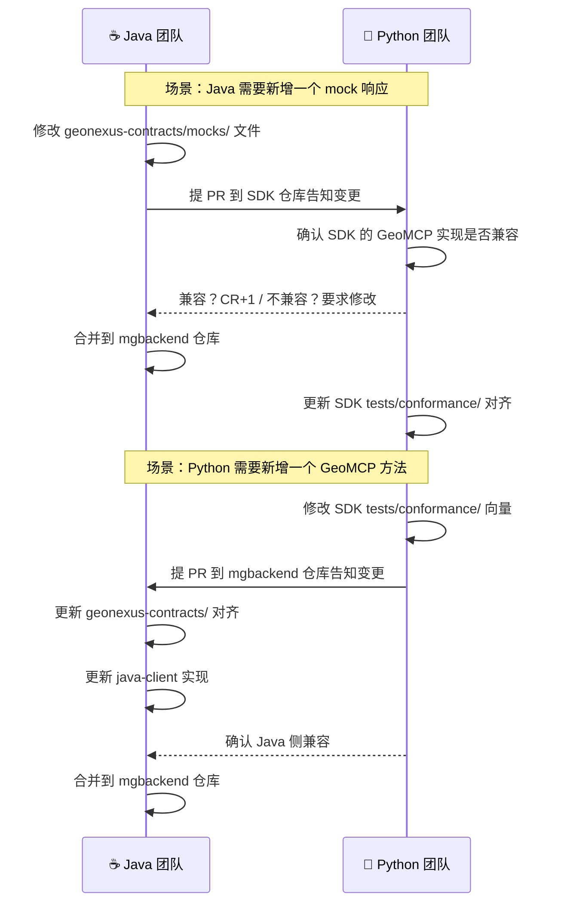

# GeoNexus Contracts — GeoMCP 协议契约

> **拥有者：Java 团队（mgbackend 仓库）**
> 本目录是 Java mgbackend（RuoYi）项目的一部分，由 Java 团队拥有并维护。
> Python 团队通过 SDK 的 `tests/conformance/` 保证 GeoMCP 实现正确性。

## 定位

契约文件定义 Java 和 Python 之间的接口约定，包含三层：

| 层 | 内容 | 文件 |
|----|------|------|
| 接口形状 | 请求/响应的 JSON 结构 | `geomcp-openapi.yaml` |
| 行为语义 | 正常/异常路径的完整响应 | `mocks/*.json` |
| 版本承诺 | 契约版本号代表的功能集合 | `VERSION` |

## 文件结构

```
geonexus-contracts/          ← 此目录将移入 mgbackend 仓库
├── VERSION                  ← 契约版本号（只在变更时 +1）
├── geomcp-openapi.yaml      ← OpenAPI 3.0 规范
├── mocks/                   ← 标准 Mock 响应（Java 侧独立开发用）
│   ├── capabilities.json    ← geo.capabilities 响应
│   ├── describe.json        ← geo.describe 响应
│   ├── execute-ndvi.json    ← geo.execute(ndvi) 成功响应
│   ├── execute-change.json  ← geo.execute(change) 成功响应
│   ├── health.json          ← GET /health 响应
│   └── errors/              ← 5 种错误场景
│       ├── contract-not-satisfied.json
│       ├── skill-not-found.json
│       ├── geocard-not-found.json
│       ├── execution-failed.json
│       └── invalid-argument.json
└── conformance/
    └── vectors.json          ← 13 个一致性测试向量
```

## 谁负责什么

| 团队 | 负责 | 不负责 |
|------|------|--------|
| **Java 团队** | 维护 `geonexus-contracts/` 目录下的所有文件 | 不需要关心 Python 端如何实现 GeoMCP |
| **Python 团队** | 通过 SDK 的 `tests/conformance/` 保证 GeoMCP Server 实现正确 | 不需要关心 Java 端如何使用 Mock |

## 版本管理

```
VERSION 文件内容：1.0.0
```

- 契约文件变更时（新增方法、修改响应结构、增加 mock），VERSION +1
- SDK 版本号与契约版本号解耦——SDK v1.1.0 可能契约仍是 v1.0.0
- Java 的 `pom.xml` 中显式声明契约版本号

```xml
<!-- mgbackend/pom.xml -->
<properties>
    <geonexus-contracts.version>1.0.0</geonexus-contracts.version>
</properties>
```

## 变更流程



## 版本历史

| 契约版本 | 日期 | 变更 |
|----------|------|------|
| 1.0.0 | 2026-09 | 初始版本：4 方法 + 5 错误码 + 7 技能 |